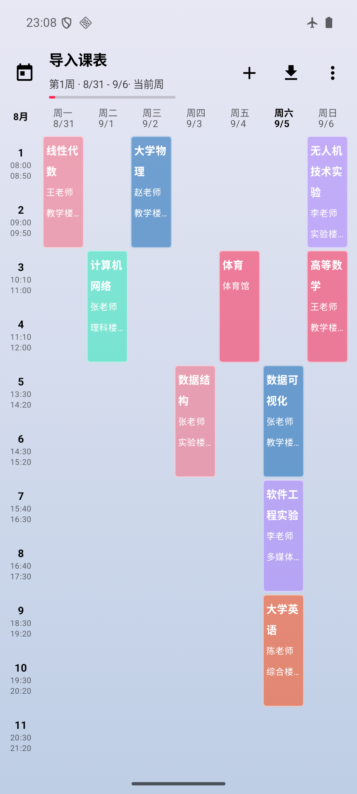
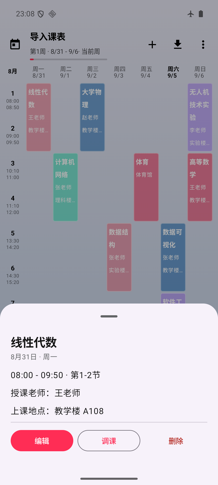

<h1 align="center">
  SleepDown
</h1>
<p align="center">
  一款支持 Android 和 iOS 的本地课程表软件。
</p>


<p align="center">
  <a href="CHANGELOG.md"></a>
  
  
  <a href="LICENSE"></a>
</p>

<p align="center">
  
  &nbsp;&nbsp;
  
</p>

SleepDown 支持课程编辑、拖动调课、多课表管理和桌面小组件。课程保存在本地，无需账号。

Android 界面使用 Jetpack Compose，iOS 使用 SwiftUI，共享课程模型与计算逻辑使用 Kotlin Multiplatform。

[开发文档](docs/development.md) · [更新日志](CHANGELOG.md)

## 功能

- **课程表**：按周查看课程，支持任意周次、单双周、多个上课时间段和自定义起止时间。
- **调课**：拖动后选择「仅本周」或「全部周次」，也可单独取消或调整某次课程。
- **课表与作息**：管理多张课表，共用时间表，设置统一课时长度和指定节次间的休息时间。
- **导入与备份**：导入 CSV、SleepDown JSON、`.wakeup_schedule` 和 ICS 文件，导出本地备份。
- **桌面小组件**：Android 提供今日、紧凑、宽屏、双日与周课表，以及背景与样式设置；iOS 提供临近课程、今日、双日与本周列表。
- **提醒与外观**：本地课程提醒、主题设置和中英文界面。

## 下载安装

在 [Releases](https://github.com/letr007/SleepDown/releases) 下载对应平台的文件：

- **Android 8.0+**：下载 `.apk` 并安装。
- **iOS 15.0+**：下载 `-unsigned.ipa`，使用自己的证书和描述文件签名后安装。IPA 不含分发签名；小组件需要 iOS 17+，签名时须为主 App 和 Widget 扩展配置一致且有权限使用的 App Group。

升级前建议导出 JSON 备份。各附件的 SHA-256 校验值见同版本的 `SHA256SUMS.txt`。

## 构建与运行

需要 JDK 17 或 21、Android SDK Platform 36。使用 Android Studio 打开项目，或在 `local.properties` 中配置 SDK 路径：

```properties
sdk.dir=/path/to/Android/sdk
```

构建 debug APK：

```sh
./gradlew :app:assembleDebug
```

构建 release APK：

```sh
./gradlew :app:assembleRelease
```

Windows 使用 `gradlew.bat`。Release 签名、设备测试与目录结构见[开发文档](docs/development.md)。

## 数据与备份

课程数据保存在设备本地。通知与闹钟权限用于课程提醒；导入文件和背景图片通过系统文件选择器获取。Android 系统备份是否保存应用数据，取决于设备设置。

升级前建议导出 **SleepDown JSON 备份**。CSV、ICS 和第三方备份的字段支持有所不同，导入后请核对课程安排。只有包名、签名一致的 APK 才能覆盖安装；卸载会清除应用私有数据。

## 当前版本

`0.1.0-beta.1` 为公开测试版。性能与稳定性仍在改进，部分操作存在卡顿或应用无响应风险。

欢迎通过 Issue 反馈问题或提交 Pull Request。反馈时请附上版本、设备型号和复现步骤；分享截图、课表或日志前，请移除个人信息。

## 更新日志

版本说明见 [CHANGELOG.md](CHANGELOG.md)。

## 许可证

本项目采用 [MIT License](LICENSE)。第三方依赖及资源遵循各自的许可证。
