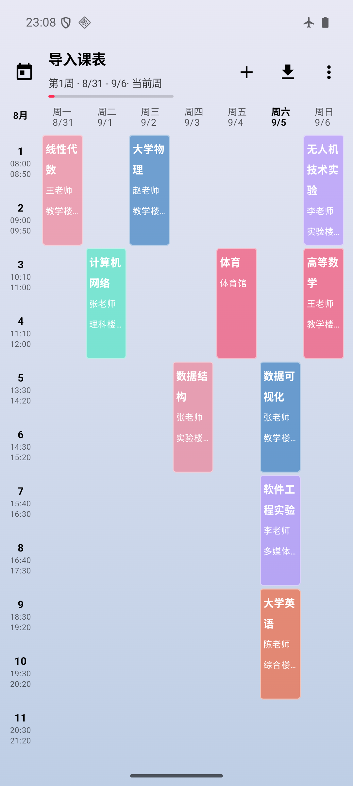
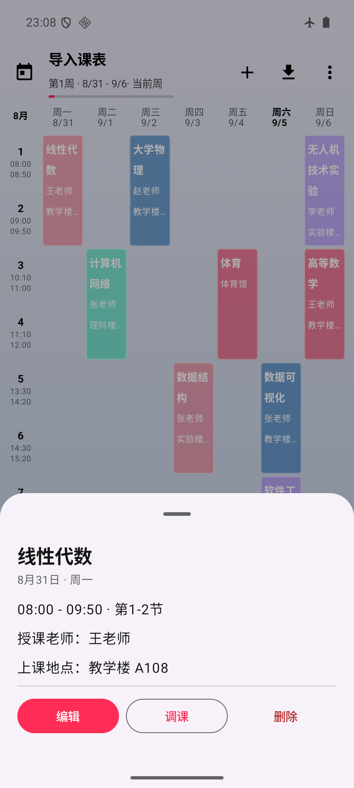

<h1 align="center">
  SleepDown
</h1>
<p align="center">
  一款 Android 本地课程表应用。
</p>

<p align="center">
  <a href="CHANGELOG.md"></a>
  
  <a href="LICENSE"></a>
  <a href="https://linux.do"></a>
</p>

<p align="center">
  
  &nbsp;&nbsp;
  
</p>

SleepDown 支持课程管理、拖动调课、多课表管理和桌面小组件。课程数据保存在本地设备，无需注册账号。界面使用 Jetpack Compose 构建，核心逻辑使用 Kotlin Multiplatform。

[开发文档](docs/development.md) · [更新日志](CHANGELOG.md)

## 功能

- 课程表：按周展示课程。支持任意周次、单双周、多上课时间段与自定义起止时间。
- 拖动调课：支持拖动调整上课时间。你可以选择“仅本周”或“全部周次”，也可以单独调整或取消某次课程。
- 课表与作息：支持管理多张课表并复用时间表。支持设置统一课时长度，以及指定节次间的休息时间。
- 导入与导出：支持导入 CSV、SleepDown JSON、`.wakeup_schedule` 和 ICS 文件；支持导出 JSON 和 ICS 文件。
- 桌面小组件：提供 5 种 Android 桌面小组件，包含今日课程（日历、列表、大字）、双日课表与周课表。支持设置背景图片与外观样式。
- 提醒与外观：支持本地课程通知提醒、深浅主题切换与中英文界面。

## 下载安装

SleepDown 最低支持 Android 8.0（API 26）。

在 [v0.1.0 发布页](https://github.com/letr007/SleepDown/releases/tag/v0.1.0) 下载设备支持的签名安装包：

| 架构 | 安装包 |
| --- | --- |
| `arm64-v8a`（64 位 ARM） | `SleepDown-0.1.0-android-arm64-v8a.apk` |
| `armeabi-v7a`（32 位 ARM） | `SleepDown-0.1.0-android-armeabi-v7a.apk` |

两个文件都是完整安装包，选择其中一个即可。仅支持 64 位应用的设备须选择 `arm64-v8a`。发布页同时提供 `SHA256SUMS.txt`，下载后可以核对文件的 SHA-256 校验和。

覆盖安装需要新旧安装包的签名与应用标识一致。卸载应用会清除本地私有数据，升级前建议先导出 JSON 备份。

## 本地构建

本地构建需要以下环境：

- JDK 17 或 21
- Android SDK Platform 36
- 项目自带的 Gradle Wrapper（8.9）

你可以使用 Android Studio 打开项目。如果在命令行构建，请在项目根目录创建 `local.properties` 文件，并配置 SDK 路径：

```properties
sdk.dir=/path/to/Android/sdk
```

构建 Debug APK：

```sh
./gradlew :app:assembleDebug
```

构建 Release APK：

```sh
./gradlew :app:assembleRelease
```

按 ARM 架构分别构建 Release APK：

```sh
./gradlew :app:assembleRelease -PsplitApks=true
```

此命令生成 `armeabi-v7a`（32 位 ARM）和 `arm64-v8a`（64 位 ARM）两个完整 APK。安装时选择设备支持的架构。

Windows 环境请使用 `gradlew.bat`。

构建产物输出位置：

- Debug APK：`app/build/outputs/apk/debug/`
- Release APK：`app/build/outputs/apk/release/`

本地未配置签名文件时，Release 构建会生成未签名 APK。签名配置和设备测试步骤请参考[开发文档](docs/development.md)。

## 数据与备份

课程数据保存在设备本地，无需注册账号。Android 系统备份是否保存应用数据，取决于设备设置。

应用使用通知与精确闹钟权限发送课程提醒。导入外部文件或选择小组件背景图片时，应用通过系统文件选择器读取文件。

JSON 备份保存课程、时间表、单次调课和取消安排，以及提醒设置。ICS 导出适合将课程导入外部日历应用。不同格式支持的字段有所差异，导入后建议核对课程安排。

## 当前版本与反馈

Android 当前正式版本为 `0.1.0`，构建号为 `6`。完整改动记录请查看 [CHANGELOG.md](CHANGELOG.md)。

如果你在使用中遇到问题或有功能建议，可以在 [GitHub Issues](https://github.com/letr007/SleepDown/issues) 提交反馈。提交时请附上设备型号、Android 版本和复现步骤；分享截图或备份文件前，请先移除个人敏感信息。

## 许可证

本项目采用 [MIT License](LICENSE)。第三方依赖及资源遵循各自的许可证。
